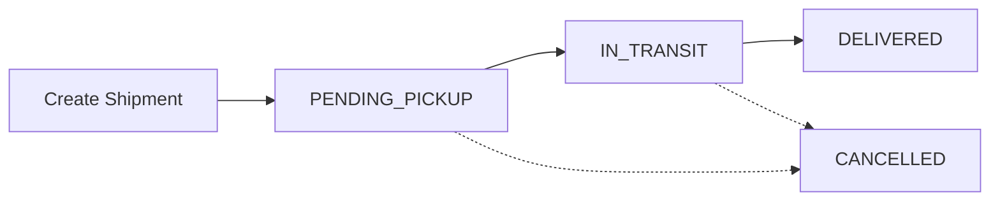

# ✅ Shipment Status Simplification - Complete

## 🎯 What Changed

Removed redundant `AWAITING_PICKUP` status since it means the same as `PENDING_PICKUP`.

### **Before:**
```prisma
enum ShipmentStatus {
  PENDING_PICKUP
  AWAITING_PICKUP    // ← Redundant!
  IN_TRANSIT
  DELIVERED
  CANCELLED
}
```

### **After:**
```prisma
enum ShipmentStatus {
  PENDING_PICKUP     // ✅ One clear status for "waiting to be picked up"
  IN_TRANSIT
  DELIVERED
  CANCELLED
}
```

---

## 📊 Simplified Shipment Flow

```
1. PENDING_PICKUP → Shipment created, waiting for pickup
                ↓
2. IN_TRANSIT    → Being transported
                ↓
3. DELIVERED     → Successfully delivered
```

**Alternative path:**
```
Any status → CANCELLED (if shipment is cancelled)
```

---

## 🔧 Files Updated

### **1. Database Schema** ✅
- `prisma/schema.prisma` - Removed `AWAITING_PICKUP` from enum

### **2. Shipments Service** ✅
- `src/shipments/shipments.service.ts` - Removed all references to `AWAITING_PICKUP`
  - `getActiveShipments()` - Now uses only `PENDING_PICKUP` and `IN_TRANSIT`
  - `getShipmentStats()` - Updated status filters

### **3. Dashboard Service** ✅
- `src/dashboard/dashboard.service.ts` - Removed all references to `AWAITING_PICKUP`
  - Cargo owner dashboard
  - Transporter dashboard
  - Stats calculations

---

## 📝 Status Definitions

| Status | Meaning | Who Can Set |
|--------|---------|-------------|
| **PENDING_PICKUP** | Shipment created, waiting for pickup | System (on creation) |
| **IN_TRANSIT** | Currently being transported | Transporter |
| **DELIVERED** | Successfully delivered to destination | Transporter |
| **CANCELLED** | Shipment cancelled | Cargo Owner or Admin |

---

## 🎨 Frontend Display

### **Status Badge Colors (Recommended)**

```css
.status-pending-pickup {
  background: #FEF3C7; /* Yellow */
  color: #92400E;
}

.status-in-transit {
  background: #DBEAFE; /* Blue */
  color: #1E40AF;
}

.status-delivered {
  background: #D1FAE5; /* Green */
  color: #065F46;
}

.status-cancelled {
  background: #FEE2E2; /* Red */
  color: #991B1B;
}
```

### **Status Display Component**

```typescript
function ShipmentStatus({ status }: { status: string }) {
  const statusConfig = {
    PENDING_PICKUP: {
      label: 'Pending Pickup',
      icon: '📦',
      color: 'yellow'
    },
    IN_TRANSIT: {
      label: 'In Transit',
      icon: '🚚',
      color: 'blue'
    },
    DELIVERED: {
      label: 'Delivered',
      icon: '✅',
      color: 'green'
    },
    CANCELLED: {
      label: 'Cancelled',
      icon: '❌',
      color: 'red'
    }
  };

  const config = statusConfig[status];

  return (
    <span className={`status-badge status-${config.color}`}>
      {config.icon} {config.label}
    </span>
  );
}
```

---

## 🧪 Testing Checklist

- [x] Schema updated (AWAITING_PICKUP removed)
- [x] Prisma client regenerated
- [x] Database synced
- [x] All code references updated
- [x] Server restarted successfully
- [ ] Test creating a shipment (should be PENDING_PICKUP)
- [ ] Test updating to IN_TRANSIT
- [ ] Test marking as DELIVERED
- [ ] Test active shipments query
- [ ] Test dashboard statistics

---

## 🚀 API Response Examples

### **Get Active Shipments**

```bash
GET /api/shipments/active
```

**Response:**
```json
[
  {
    "id": "ship_123",
    "cargo": "Electronics",
    "status": "PENDING_PICKUP",    // ✅ Clear status
    "fromLocation": "Lusaka",
    "toLocation": "Kitwe",
    // ...
  },
  {
    "id": "ship_124",
    "cargo": "Mining Equipment",
    "status": "IN_TRANSIT",
    // ...
  }
]
```

### **Update Shipment Status**

```bash
PATCH /api/shipments/:id
{
  "status": "IN_TRANSIT"  // ✅ No more confusion between PENDING and AWAITING
}
```

---

## 📋 Migration Notes

### **For Existing Data:**

If you had shipments with `AWAITING_PICKUP` status in the database, you would need to migrate them:

```sql
-- This would have been needed if you had existing data
UPDATE "Shipment" 
SET status = 'PENDING_PICKUP' 
WHERE status = 'AWAITING_PICKUP';
```

**Note:** Since your database was already in sync, this means either:
- You didn't have any shipments with `AWAITING_PICKUP`, or
- The status was never actually used in the database

---

## 🎯 Benefits of This Change

1. **Clearer Logic** ✅
   - One status = one meaning
   - No confusion between "pending" and "awaiting"

2. **Simpler Code** ✅
   - Fewer status checks
   - Cleaner conditional logic

3. **Better UX** ✅
   - Clear status progression for users
   - Easier to understand the shipment lifecycle

4. **Reduced Bugs** ✅
   - Fewer edge cases to handle
   - Less room for status-related errors

---

## 📊 Current Status Flow



---

## ✅ Summary

**Removed:** `AWAITING_PICKUP` (redundant)  
**Kept:** `PENDING_PICKUP` (clear and sufficient)  
**Result:** Cleaner, simpler shipment status system  

All code updated and server running successfully! 🎉

